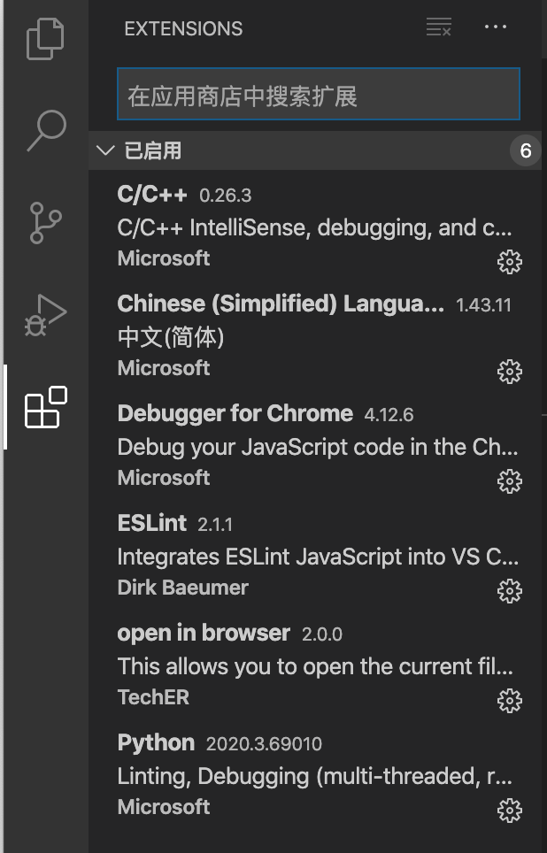
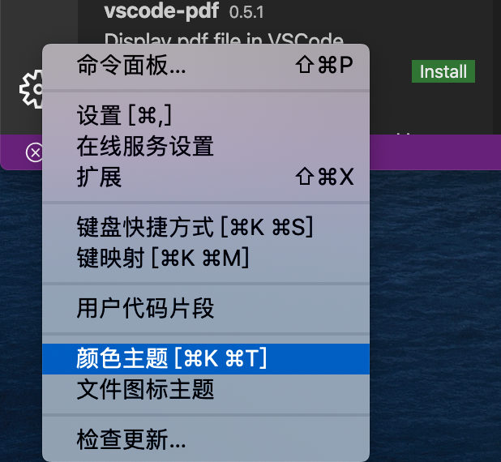

# 开发工具选择

### 使用工具

- 工具：`VSCode`
- 来自微软，一个开源的，基于Electron的轻量级编辑器

### VSCode使用方式

- 建议安装插件

  - 
  - `Chinese(simplified) Language...` 软件中文
  - `open in browser` 在浏览器中打开
  - `view in browser` 
  - `Debugger for Chrome` 使用Chrome浏览器打断点

- 主题设置

  - 

  

