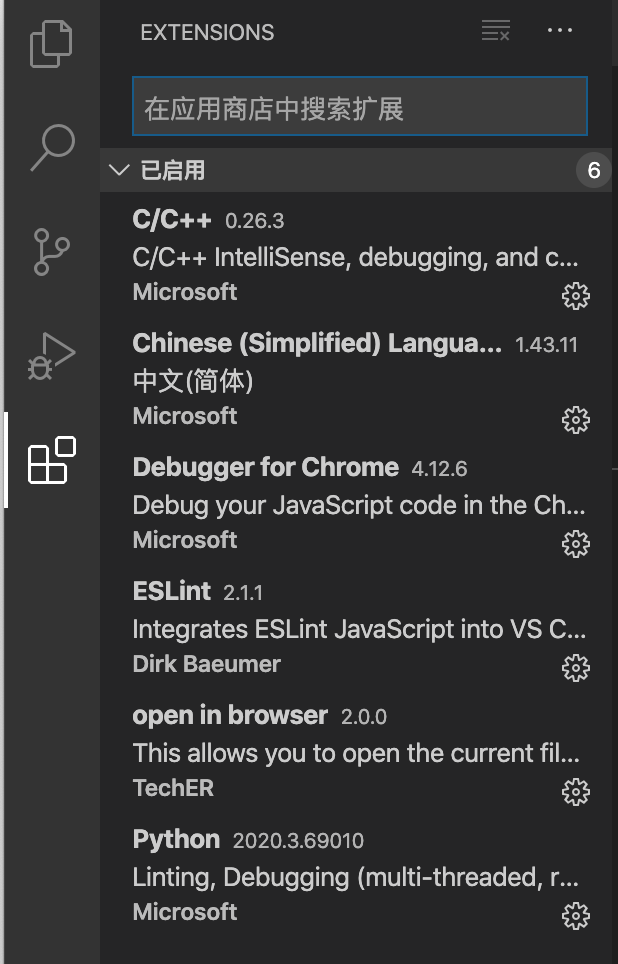
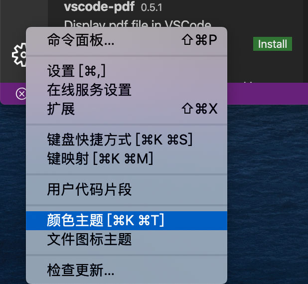

# 开发工具选择

### 使用工具

- 工具：`VSCode`
- 来自微软，一个开源的，基于Electron的轻量级编辑器

### VSCode使用方式

- 建议安装插件

  - 
  - `Chinese(simplified) Language...` 软件中文
  - `open in browser` 在浏览器中打开
  - `view in browser` 
  - `Debugger for Chrome` 使用Chrome浏览器打断点
  
- 主题设置

  - 
  
- 编辑设置
  
  - 设置代码折行：设置中搜索 `word wrap`
  
- 常用快捷键

  - <kbd>ctrl</kbd> + <kbd>z</kbd> ,<kbd>ctrl</kbd> + <kbd>y</kbd> :撤销，前进
  - <kbd>shift</kbd> + <kbd>end</kbd> ,<kbd>shift</kbd> + <kbd>home</kbd> :从头，尾部选中一行
  - <kbd>shift</kbd> + <kbd>alt</kbd> + <kbd>⬇️</kbd> :快速复制一行
  - <kbd>alt</kbd> + <kbd>⬆️</kbd> / <kbd>⬇️</kbd> :上下移动一行
  - <kbd>alt</kbd> +鼠标左键 ：多光标
  - <kbd>ctrl</kbd> + <kbd>d</kbd> :批量选择相同

- 搜索

  - 左边搜索栏

  

